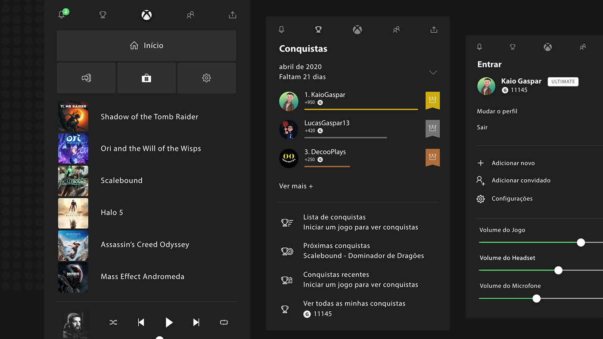
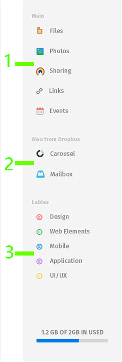
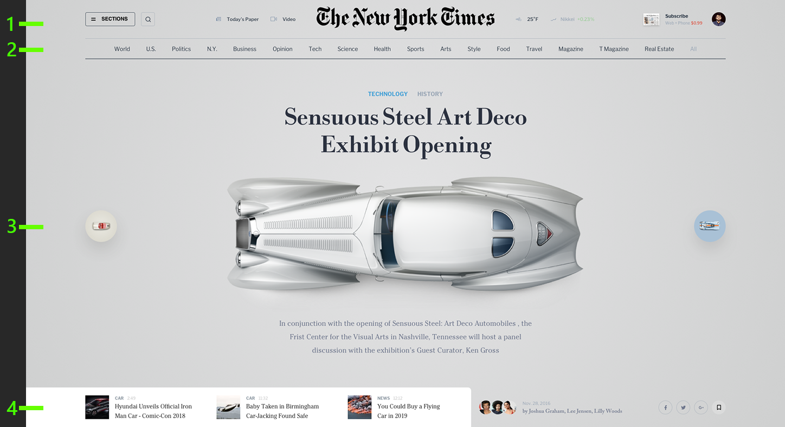
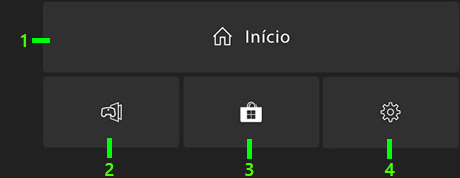
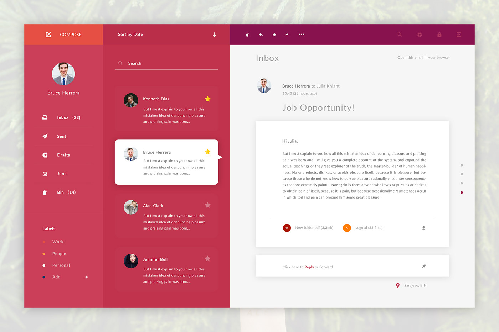

Layouts is one of the most important concepts in any Graphical User Interface (GUI) designing.

An application's User Interface may consist of several screens or pages. The Lay out of each screen is what is commonly referred to as the "layout", so layout is self explanatory. But what you may not know is, that certain parts of the screen may change but not those directly inside a layout. View allows positions of an item inside of it to change, but layouts don't, that is to say that there is another UI concept and component called views which will be discussed later.

So, Layouts are static whereas Views are dynamic. Views reside inside layouts, and also views may lay out themselves using layouts. So knowledge of layouts is indispensable.

Qml has four(4) layout types, you can combine then to create whatever layout you want. The types are RowLayout (row layout), ColumnLayout (column layout), GridLayout (grid layout), and StackLayout (stack layout).


#### ColumnLayout

**ColumnLayout** - arranges its contents so that we get a column, but also each of the items in there is a row inside the column. So we have something like shown in the images below.

The numbers shows the direct contents of the Column layout. These are rows inside a column. Together they form a column.

*App sample 1 - the white pane is a background for the numbers*




*App sample 2 - the black pane is a background for the numbers*




#### RowLayout

**RowLayout** - arranges its contents so that we get a row, but each of the items in there is a column inside the row. So we have something like shown in the images below.

The numbers shows the direct contents of the Row layout. These are columns inside a row. Together they form a row.

*App sample 1* - the dark grey pane is a background for the numbers


*App sample 2* - the black pane is a background for the numbers


#### GridLayout

**GridLayout** - arranges its contents so that we get a grid, but each of the items in there is a cell inside the grid. When a grid layout is implemented. The number of rows and/or columns are indicated. Which means that the minimum width and/or height of each cell is indicated, so if a cell wants to be larger than the rest it can just say so and take up space belonging to other cells. So we have something like shown in the images below.

The numbers shows the direct contents of the Grid layout. These are cells inside the grid. Together they form a grid.


*App sample 1 - the black pane is a background for the numbers*




#### StackLayout

**StackLayout** - arranges its contents so that only one is visible at any particular time, the rest are hidden, behind it, so to speak. Each of the items is called a stack item.


## Import layouts

To start using layouts in any qml file, you will need it imported in that qml file.

```
import QtQuick.Layouts 1.3
```

The digit after the dot corresponds with you QtQuick import. eg:

If you import *QtQuick 2.12*, you should import *QtQuick.Layouts 1.12,* for *QtQuick 2.13*, you import *QtQuick.Layouts 1.13*, and so on. Going back to *QtQuick 2.11*, *QtQuick.Layouts 1.4* is used and not (*QtQuick.Layouts 1.11*), from *QtQuick 2.10*, *QtQuick.Layouts 1.3* is used and so on.

So, the top most of your qml file looks like this at the least, if you want to work with layouts.


```qml
import QtQuick 2.12
import QtQuick.Layouts 1.12
```

From now on you can start declaring qml layout type, like we have explained about above.


## Layout

Layout type exists only to provide properties to use when defining your layouts. Actually all the other layout types inherent from this basic type. You will not use it directly. When studying the other types you will see it being declared as

```qml
Layout.property: value
```

**NB:** Qml object types always start with an uppercase letter.


## ColumnLayout

Use cases for ColumnLayout


### Declaration

```qml
ColumnLayout {
    code goes
    here
}
```


### Basic Usage

Say we have a file, *columnlayout.qml*

```qml
import QtQuick 2.12
import QtQuick.Layouts 1.12
import QtQuick.Controls 2.12

ApplicationWindow {
    visible: true
    width: 400
    height: 400

    ColumnLayout {
        width: 400
        height: 400

        Rectangle {
            width: 400
            height: 200
            color: "darkgrey"
        }

        Rectangle {
            width: 400
            height: 200
            color: "dodgerblue"
        }

    }

}

```

When you run this in Ninja-Preview and you see that we have a basic Column Layout


#### Layout.fillWidth

`Layout.fillWidth: true` is just the right code to use when you want to make your width the same as that of the parent, since columnLayout does not allow child Items to access its width.

`width: parent.width` will fail but `width: 200` won't. For columnLayout you can use this code but don't, use Layout.fillWidth instead. Its clean and pragmatic.


##### Possible values

```qml
Layout.fillWidth: true
```

and

```qml
Layout.fillWidth: false
```

Unless you have other width-based properties set this will make that no width will be supplied


## RowLayout

RowLayout description


## GridLayout

GridLayout description


## StackLayout

StackLayout description


## Common Usage

The complete layouting of an application is designed using multiple combinations of row and column layouts sometimes also stack layouts, but almost never grid layout. That is to say that the Grid layout is the least used layout type, if the application seems to have a grid then it is a Grid view and not a Grid Layout.

The first layout first, then the other layouts will be inside of it. In that case we look for what layout should be the parent layout, then the other layout will conform to the various parts where they fit. The parent layout would be either of  RowLayout or ColumnLayout, as stack layout also may not be suitable as an overall parent layout, since it will require switching between what can be seen and what can't

*App sample 1*




The above image shows an Application, with most probably a RowLayout as its parent layout. That is to say that it could have also been a columnLayout but based on the fact that the top nav seem dependent on the content below, a RowLayout is best suited for the job, even though there is also a drawer, which just snaps itself, and whatever parent layout you have is up to you.
